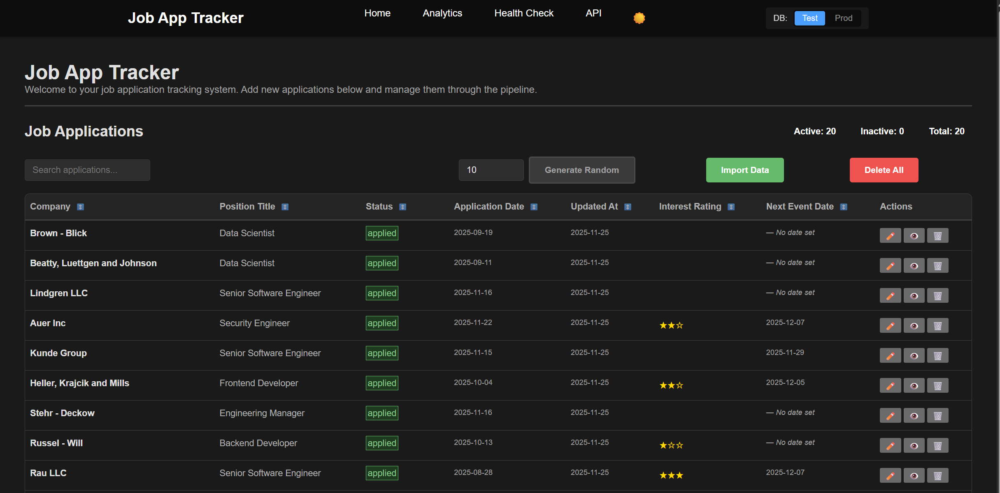

# Job Application Tracker

A lightweight, single-user job application tracking system built with TypeScript and Bun. Features customizable pipeline workflows, PDF form filling capabilities, and integrated task management.



## Features

- **Application Management**: Track job applications with company, position, status, interest rating, and timestamped notes
- **Customizable Pipeline**: Two-category status system (active/inactive) with configurable workflow stages
- **Contact Management**: Track contacts associated with job applications
- **Interview Stages**: Monitor interview progress through customizable stages
- **Analytics Dashboard**: Visual insights into job search metrics and trends
- **Browser Extension**: Quick-capture job postings from LinkedIn, Indeed, Greenhouse, Lever and other job boards
- **PDF Integration**: Fill PDF forms automatically using application data with extensible template system
- **Feature Flags**: Browser-based feature toggles for testing and development tools
- **Comprehensive Testing**: Unit tests with coverage and E2E tests using Playwright

## Architecture

Built using hexagonal architecture principles with clean separation of concerns:
- **Domain Layer**: Core business logic and entities
- **Application Layer**: Use cases and API routes
- **Infrastructure Layer**: Database, PDF processing, file system
- **Presentation Layer**: HTMX-powered web interface

See [docs/PRD.md](./docs/PRD.md) for detailed requirements and architecture diagrams.

## Tech Stack

- **Runtime**: Bun
- **Language**: TypeScript
- **Database**: SQLite (using Bun's built-in driver)
- **Web Framework**: ElysiaJS with HTMX
- **Validation**: ArkType
- **Error Handling**: NeverThrow
- **PDF Processing**: PDF-lib
- **Testing**: Playwright (E2E), Bun Test (unit)
- **Code Quality**: Biome (linting, formatting)
- **Git Hooks**: Husky with lint-staged

## Getting Started

### Prerequisites
- [Bun](https://bun.sh/) v1.2.21 or later

### Installation

```bash
# Clone the repository
git clone https://github.com/graffhyrum/jobapptracker.git
cd jobAppTracker

# Install dependencies
bun install

# Set up environment variables
cp .env.example .env
# Edit .env with your configuration (see Environment Variables section)
```

### Environment Variables

The following environment variables are available:

| Variable | Type | Description | Default |
|----------|------|-------------|---------|
| `BASE_URL` | string | Base URL for the application | `http://localhost` |
| `PORT` | number | Port number for the server | `3000` |
| `JOB_APP_MANAGER_TYPE` | string | Database mode (`prod` or `test`) | `prod` |
| `BROWSER_EXTENSION_API_KEY` | string | API key for browser extension authentication | `dev-api-key` |

### Development

```bash
# Run in development mode with watch
bun dev

# Run all tests (unit + E2E)
bun test:all

# Run unit tests only
bun test:unit

# Run E2E tests
bun test:e2e

# Build for production
bun build

# Full code quality check
bun vet
```

### Usage

1. Start the application: `bun dev`
2. Open your browser to the mapped host and port.
3. Begin tracking your job applications!

## Feature Flags

The application includes a feature flag system that allows you to enable developer tools and testing features directly from the browser console. By default, the application runs in production mode with all testing tools hidden.

### Available Feature Flags

| Flag | Description | Default |
|-------|-------------|-----------|
| `enableTestTools` | Shows database selector and other testing tools in the navigation bar | `false` |

### Browser Console API

Open your browser's developer console (F12) and use the following commands:

```javascript
// List all available feature flags
featureFlags.list()

// Get current flag values
featureFlags.getFlags()

// Enable a specific flag
featureFlags.enable('enableTestTools')

// Disable a specific flag
featureFlags.disable('enableTestTools')

// Toggle a flag (enable if disabled, disable if enabled)
featureFlags.toggle('enableTestTools')

// Reset all flags to defaults
featureFlags.reset()
```

### Example Usage

```javascript
// Enable testing tools to see database selector
featureFlags.enable('enableTestTools')

// The database selector will now appear in the navigation bar
// allowing you to switch between test and production databases

// Disable testing tools when done
featureFlags.disable('enableTestTools')
```

### Benefits

- **Security by Default**: Production behavior is the default, ensuring no accidental exposure of testing tools
- **User Control**: Individual users can enable testing tools when needed without server changes
- **Persistent**: Your feature flag preferences are saved in browser localStorage
- **Real-time**: Changes take effect immediately without page reload
- **Extensible**: Easy to add new feature flags for future development tools

## Browser Extension

A companion browser extension allows you to quickly capture job postings from job boards and save them directly to your tracker.

### Quick Start

1. **Configure API Key**: Set `BROWSER_EXTENSION_API_KEY` in your `.env` file
2. **Install Extension**:
   - Chrome/Edge: Load `extension/` folder as unpacked extension
   - Firefox: Load `extension/manifest.json` as temporary add-on
3. **Configure Extension**: Click extension icon → Settings
   - API URL: `http://localhost:3000`
   - API Key: Same as your `.env` file
4. **Use**: Visit any job posting and click the extension icon!

### Supported Sites

- LinkedIn Jobs
- Indeed
- Greenhouse
- Lever
- Generic fallback for other sites

For detailed installation and usage instructions, see [extension/README.md](extension/README.md).

## Project Structure

```
src/
├── domain/                    # Core business logic
│   ├── entities/             # Rich domain objects with behavior
│   ├── ports/                # Interfaces for infrastructure
│   └── use-cases/            # Application workflows
├── application/              # Use cases and application services
│   └── server/               # ElysiaJS server setup
│       ├── plugins/          # Route plugins for modularity
│       └── utils/            # Server utilities
├── infrastructure/           # External system adapters
│   ├── adapters/            # Concrete implementations of ports
│   ├── config/              # Configuration files
│   ├── di/                  # Dependency injection
│   ├── file-io/             # File system operations
│   ├── storage/             # Storage provider interfaces
│   ├── uuid-generation/     # UUID generation
│   └── utils/               # Infrastructure utilities
├── presentation/             # Web interface
│   ├── assets/              # Static assets (images, etc.)
│   ├── components/          # HTML rendering functions
│   ├── pages/               # Full page templates
│   ├── schemas/             # ArkType validation schemas
│   ├── scripts/             # Client-side JavaScript
│   ├── styles/              # CSS files
│   ├── types/               # Presentation layer types
│   └── utils/               # Presentation utilities
├── forms/                    # PDF form templates and mappings
├── helpers/                  # General utility functions
└── index.ts                 # Application entry point

extension/                    # Browser extension for quick job capture
├── manifest.json            # Extension configuration
├── content/                 # Page data extraction scripts
├── popup/                   # Extension popup UI
├── options/                 # Settings page
├── background/              # Background service worker
└── icons/                   # Extension icons

docs/
├── PRD.md                   # Product Requirements Document
├── THEME_GUIDE.md           # UI theming guidelines
├── TEST_PLAN.md             # Testing strategy
└── ai/                      # AI assistant guides
    ├── HTML_GUIDE.md        # HTML conventions
    └── PAGE_OBJECT_GUIDE.md # E2E test patterns

tests/                        # Test files (colocated with source)
```

## Development Status

**Current Version**: 0.4.0

This project is actively developed with regular releases. See [CHANGELOG.md](./CHANGELOG.md) for version history and [docs/PRD.md](./docs/PRD.md) for the complete roadmap and feature specifications.

## License

Private project - not licensed for distribution.

## Contributing

This project uses conventional development workflows:

- **Code Style**: Configured with Biome (see biome.json)
- **Testing**: Place tests next to source files (*.test.ts)
- **Git Hooks**: Pre-commit hooks run code formatting and linting
- **Changesets**: Use `@changesets/cli` for version management

See [AGENTS.md](./AGENTS.md) for detailed development guidelines and available commands.
