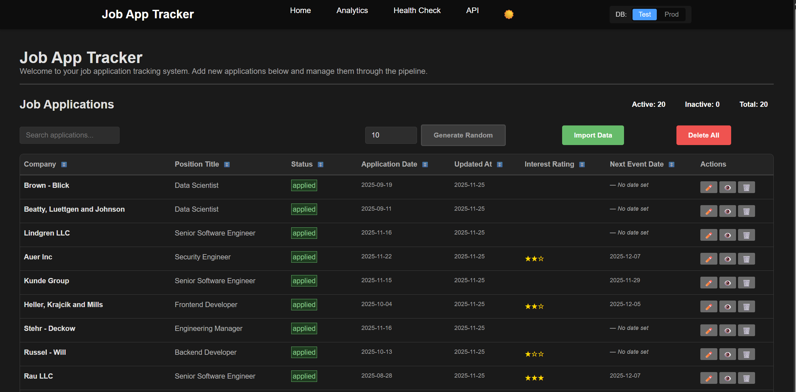

# Job Application Tracker

A lightweight, single-user job application tracking system built with TypeScript and Bun. Track applications through customizable pipeline stages, manage contacts and interviews, and analyze your job search with built-in analytics. Includes a browser extension for quick capture from LinkedIn, Indeed, Greenhouse, Lever, and other job boards.



## Quick Start

```bash
# Prerequisites: Bun v1.2.21+
bun install
cp .env.example .env   # edit with your config
bun dev                 # http://localhost:3000
```

## Tech Stack

| Category       | Technology                        |
| -------------- | --------------------------------- |
| Runtime        | Bun                               |
| Language       | TypeScript                        |
| Database       | SQLite (Bun built-in driver)      |
| Web Framework  | ElysiaJS                          |
| Frontend       | HTMX + server-rendered HTML       |
| Validation     | ArkType                           |
| Error Handling | NeverThrow                        |
| Testing        | Bun Test (unit), Playwright (E2E) |
| Code Quality   | OXC (oxlint + oxfmt)              |
| Git Hooks      | Husky + lint-staged               |

## Features

- **Application Management** -- CRUD with company, position, status, interest rating, dates, URLs, notes
- **Customizable Pipeline** -- Two-category status system (active/inactive) with configurable stages
- **Contact Tracking** -- Contacts per application with channel, role, outreach date, response tracking
- **Interview Stages** -- Round-by-round tracking with type, dates, questions, and notes
- **Analytics Dashboard** -- Chart.js visualizations with date range filtering (status distribution, time-in-status, source effectiveness)
- **Light/Dark Theme** -- Toggle via navbar, persists in localStorage, respects `prefers-color-scheme`
- **Browser Extension** -- Quick-capture job postings from LinkedIn, Indeed, Greenhouse, Lever, and generic sites
- **Feature Flags** -- Browser console API for toggling developer tools (`featureFlags.enable('enableTestTools')`)

## Architecture

Built on hexagonal (ports and adapters) architecture with clean layer separation:

```
presentation -> application -> domain -> infrastructure (via ports)
```

- **Domain** -- Entities, port interfaces, analytics use-cases. No framework dependencies.
- **Application** -- ElysiaJS server with route plugins. Each plugin receives dependencies as function parameters.
- **Infrastructure** -- SQLite adapters implementing domain ports. DI via factory functions.
- **Presentation** -- HTML template functions, CSS design system, HTMX-driven partial updates.

See [docs/PRD.md](./docs/PRD.md) for detailed requirements and [docs/design-guidelines.md](./docs/design-guidelines.md) for the CSS/UI system.

## Commands

| Command             | Description                                     |
| ------------------- | ----------------------------------------------- |
| `bun dev`           | Start dev server with watch mode                |
| `bun build`         | Build production binary to `dist/jobapptracker` |
| `bun test:unit`     | Run unit tests                                  |
| `bun test:coverage` | Unit tests with coverage (90% threshold)        |
| `bun test:e2e`      | Run Playwright E2E tests                        |
| `bun test:all`      | Unit tests with coverage + E2E                  |
| `bun fix`           | Lint + format with auto-fix                     |
| `bun typecheck`     | `tsc --noEmit`                                  |
| `bun vet`           | Full quality gate (fix + typecheck + all tests) |

## Environment Variables

| Variable                    | Type   | Default            | Description                           |
| --------------------------- | ------ | ------------------ | ------------------------------------- |
| `BASE_URL`                  | string | `http://localhost` | Base URL for the application          |
| `PORT`                      | number | `3000`             | Server port                           |
| `JOB_APP_MANAGER_TYPE`      | string | `prod`             | Database mode (`prod` or `test`)      |
| `BROWSER_EXTENSION_API_KEY` | string | _(none)_           | API key for extension auth (optional) |

## Browser Extension

A companion browser extension captures job postings and saves them directly to the tracker.

1. Set `BROWSER_EXTENSION_API_KEY` in `.env`
2. Load `extension/` as an unpacked extension (Chrome/Edge) or temporary add-on (Firefox)
3. Click extension icon, configure API URL (`http://localhost:3000`) and API key
4. Visit any job posting and click the extension icon to capture

Supports: LinkedIn Jobs, Indeed, Greenhouse, Lever, and generic fallback for other sites.

See [extension/README.md](./extension/README.md) for detailed setup.

## Project Structure

```
src/
  domain/              # Entities, ports, use-cases (no framework deps)
  application/server/  # ElysiaJS setup + route plugins
  infrastructure/      # SQLite adapters, DI, config
  presentation/        # HTML templates, CSS, client scripts, schemas
  helpers/             # General utilities
extension/             # Browser extension (content scripts, popup, options)
docs/                  # PRD, design guidelines, roadmap, theme guide
tests/                 # Test adapters, E2E POMs, fixtures
```

## Documentation

- [Product Requirements](./docs/PRD.md)
- [Design Guidelines](./docs/design-guidelines.md) -- CSS architecture and component patterns
- [Theme Guide](./docs/THEME_GUIDE.md) -- color variables and dark mode
- [Project Roadmap](./docs/project-roadmap.md) -- phases, monetization, analytics plans
- [Changelog](./docs/changelog.md) -- recent changes by category
- [Test Plan](./docs/TEST_PLAN.md) -- testing strategy

## Contributing

- **Code style**: OXC (see `.oxlintrc.json`, `.oxfmtrc.json`)
- **Tests**: Colocated with source (`*.test.ts`)
- **Git hooks**: Pre-commit runs formatting and linting
- **Changesets**: Use `@changesets/cli` for version management

## License

Private project -- not licensed for distribution.

**Current Version**: 0.4.0
