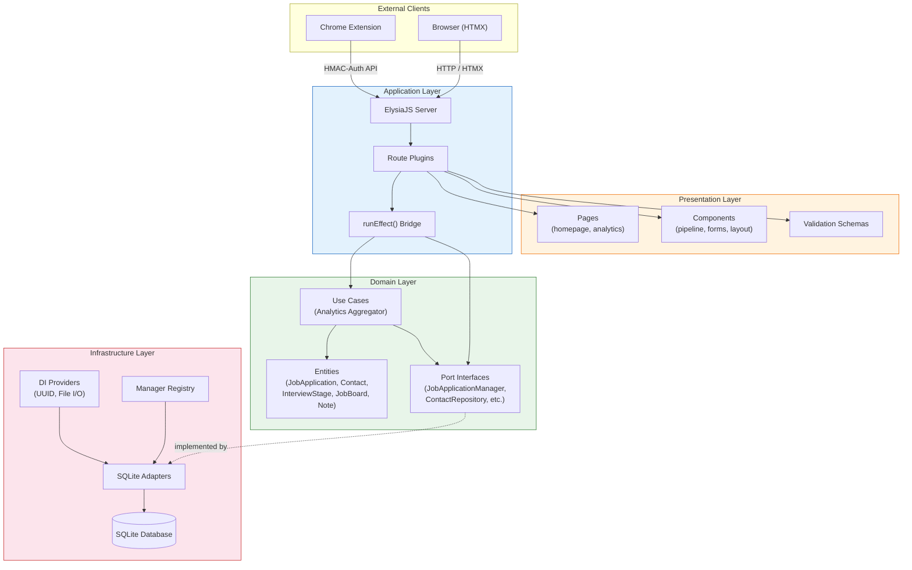
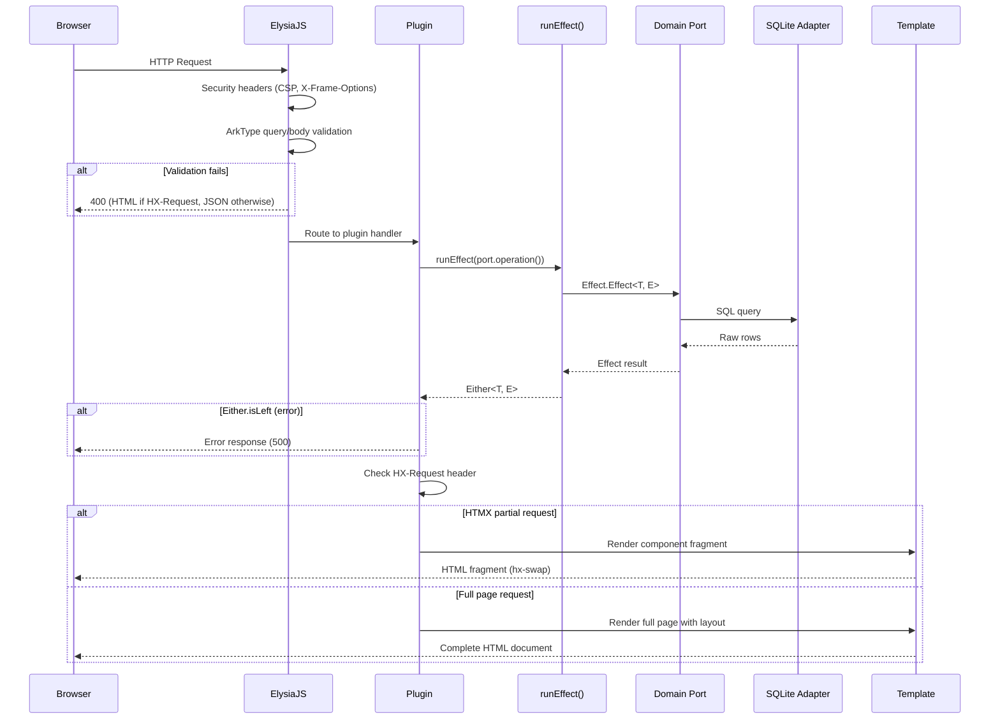
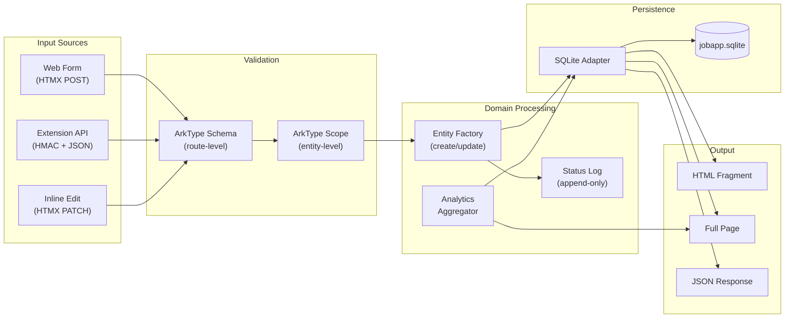
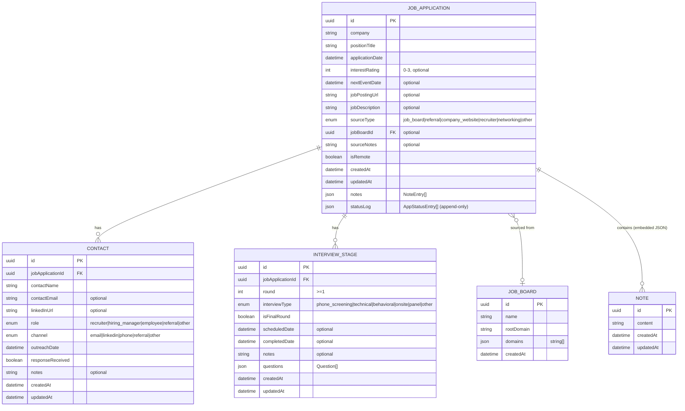
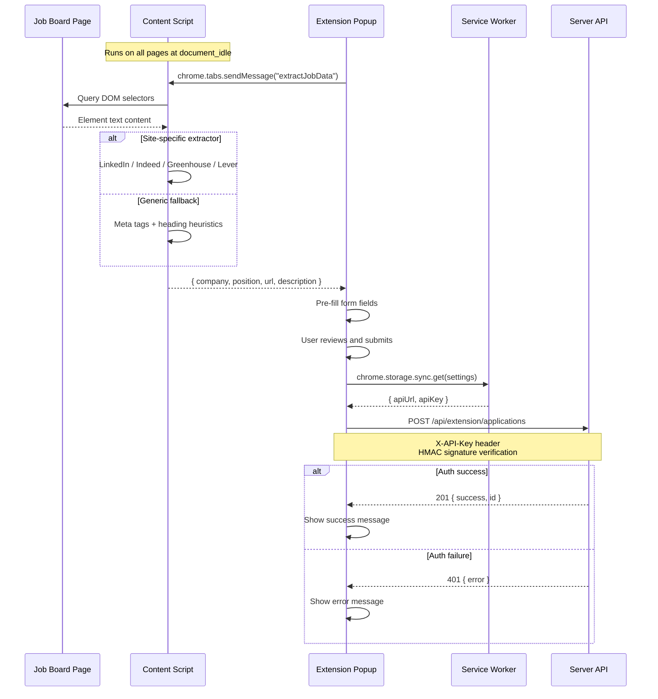

# System Architecture

This document describes the architecture of Job Application Tracker using diagrams and explanations of data flow, component relationships, and entity models.

## Hexagonal Architecture (Ports and Adapters)

The system follows hexagonal architecture where domain logic is isolated from infrastructure through port interfaces. Dependencies always point inward: infrastructure depends on domain, never the reverse.



## Request Lifecycle

Every HTTP request flows through a consistent lifecycle. The server differentiates between HTMX partial requests and full-page loads.



### HX-Request Detection

The server checks the `HX-Request` header to determine response format:

- **HTMX request** (`HX-Request: true`): Returns an HTML fragment that HTMX swaps into the existing DOM
- **Full page request**: Returns a complete HTML document with layout, navbar, and HTMX/CSS includes
- **API request** (extension): Returns JSON

### Error Handling Flow

The global `onError` handler in `startElysiaServer.ts` catches all unhandled errors and formats responses based on the request type:

- `NOT_FOUND` -- 404 JSON response
- `VALIDATION` -- 400 with HTML (HTMX) or JSON (API)
- `PARSE` -- 400 with error text
- Other -- 500 with error message

## Data Flow



## Entity Relationship Diagram



### Key Entity Design Decisions

- **Status log is append-only**: Every status change creates a new `[datetime, status]` tuple. The current status is always the last entry. This preserves the full transition history.
- **Notes are embedded JSON**: Notes are stored as a JSON array within the job application row, managed by a `NotesCollectionManager` that provides CRUD operations on the array.
- **Questions are embedded in interview stages**: Each interview stage contains a `questions` JSON array with `{id, title, answer?}` objects.
- **Job boards are a lookup table**: Seeded with common boards (LinkedIn, Indeed, etc.) and matched by domain for source attribution.

## Extension Architecture



### Extension Components

| Component      | File                                     | Responsibility                                                                                                       |
| -------------- | ---------------------------------------- | -------------------------------------------------------------------------------------------------------------------- |
| Content Script | `extension/content/extractor.js`         | DOM scraping with site-specific extractors for LinkedIn, Indeed, Greenhouse, Lever; generic fallback using meta tags |
| Popup          | `extension/popup/popup.{html,js,css}`    | Capture form UI, triggers extraction, submits to API                                                                 |
| Service Worker | `extension/background/service-worker.js` | Install/update lifecycle, opens options on first install                                                             |
| Options        | `extension/options/options.{html,js}`    | Server URL and API key configuration, stored in `chrome.storage.sync`                                                |

### Extension Authentication

The server-side plugin (`extension-api.plugin.ts`) authenticates extension requests using HMAC:

1. Extension sends `X-API-Key` header with each request
2. Server computes HMAC signature and uses `timingSafeEqual` for comparison
3. The `BROWSER_EXTENSION_API_KEY` env var must be at least 32 characters
4. CORS headers are set to allow extension origin

## Plugin Composition

The ElysiaJS server assembles functionality through plugin composition. Each plugin encapsulates a feature's routes and receives dependencies through Elysia's derive mechanism.

| Plugin                       | Prefix              | Responsibility                           |
| ---------------------------- | ------------------- | ---------------------------------------- |
| `pages.plugin.ts`            | `/`                 | Homepage, health check                   |
| `applications.plugin.ts`     | `/applications`     | Application CRUD, search, status updates |
| `pipeline.plugin.ts`         | `/api`              | Pipeline data API                        |
| `contacts.plugin.ts`         | `/contacts`         | Contact CRUD                             |
| `interview-stages.plugin.ts` | `/interview-stages` | Interview stage CRUD                     |
| `analytics.plugin.ts`        | `/analytics`        | Analytics dashboard                      |
| `extension-api.plugin.ts`    | `/api/extension`    | Browser extension API                    |
| `dev-tools.plugin.ts`        | `/dev`              | Dev-only DB switching (conditional)      |

### Dependency Injection Through Plugins

Repository plugins (`jobApplicationManager.plugin.ts`, `contactRepository.plugin.ts`, etc.) use Elysia's `.derive()` to inject domain services into the request context. Feature plugins compose these repository plugins via `.use()`:

```
analyticsPlugin
  ├── .use(jobApplicationManagerPlugin)
  ├── .use(contactRepositoryPlugin)
  ├── .use(interviewStageRepositoryPlugin)
  └── .derive() → analyticsAggregator
```

## Security Headers

Applied globally via `onBeforeHandle`:

- `X-Content-Type-Options: nosniff`
- `X-Frame-Options: DENY`
- `Content-Security-Policy`: self + unsafe-inline for scripts/styles + cdn.jsdelivr.net for HTMX

## Related Documentation

- [Project Overview](project-overview-pdr.md) -- product features and roadmap
- [Codebase Summary](codebase-summary.md) -- file inventory and dependencies
- [Code Standards](code-standards.md) -- error handling, validation, and DI patterns
